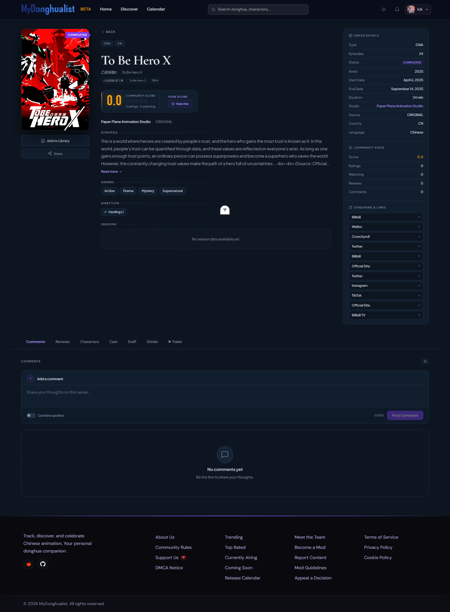
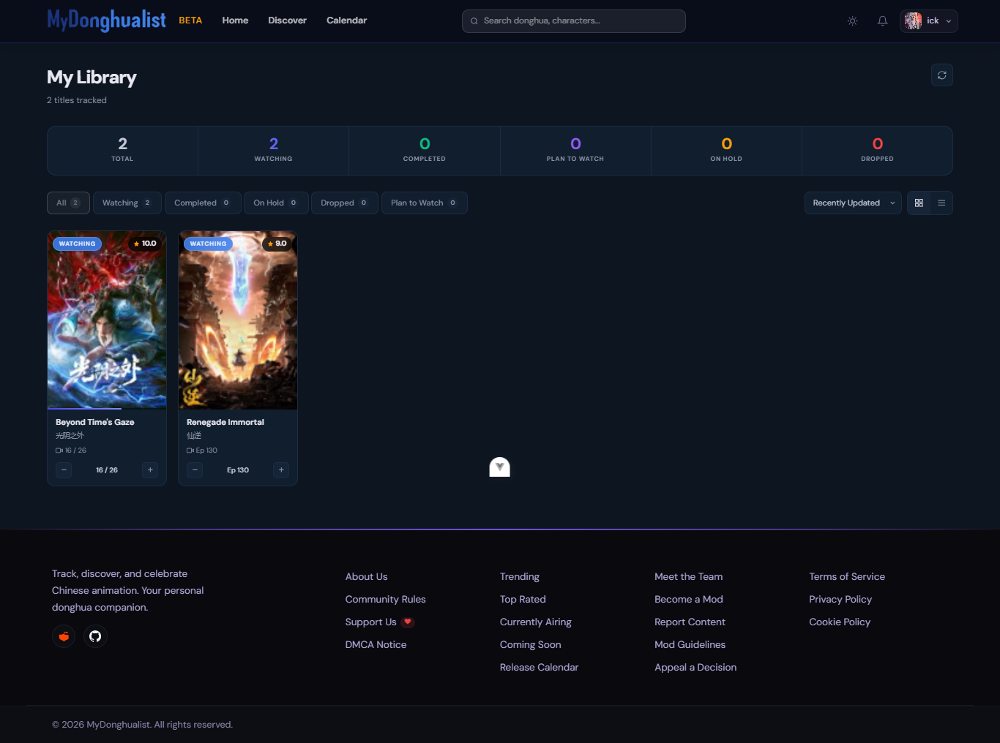
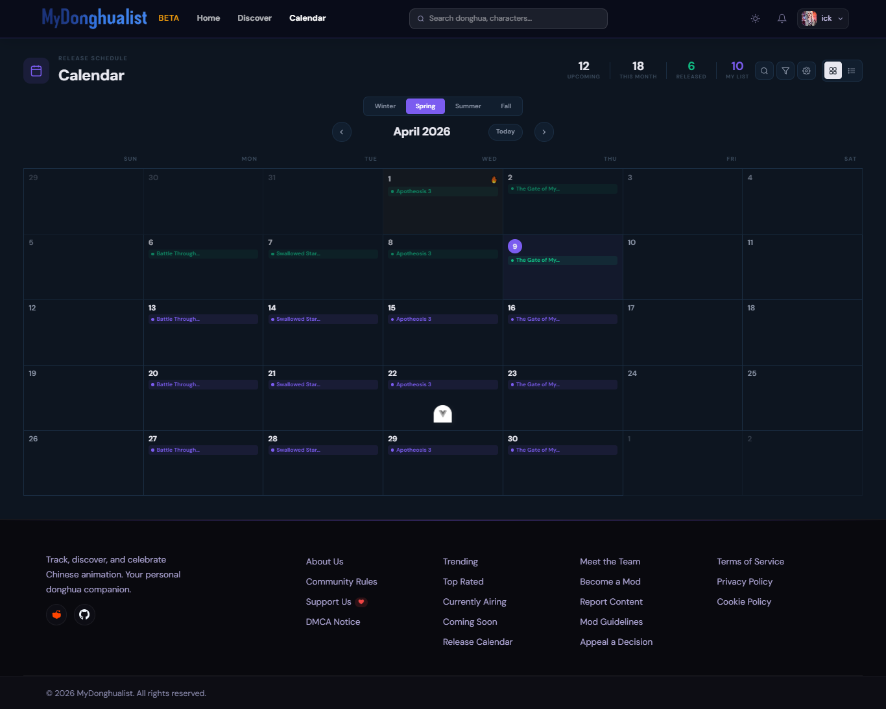
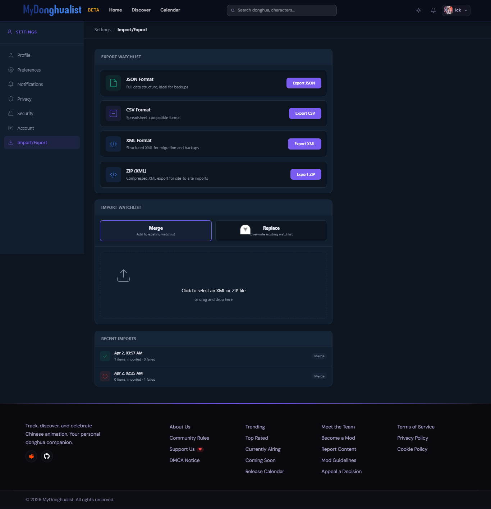

# MyDonghuaList

MyDonghuaList is a modern platform for **discovering, tracking, and managing Donghua** (Chinese animation).  
It allows users to search for series, track their watchlist, rate titles, manage their viewing progress, and engage with a community of fans.

---

## Screenshots

### Home Page

### Donghua Details

### Watchlist

### Episode Calendar

### Import & Export

---

## Features

- Search and discover Donghua with advanced filters
- Detailed pages including synopsis, genres, staff, ratings, and episode info
- Personal watchlist to track what you're watching, completed, or planning
- Rate and review titles to share your thoughts with the community
- User authentication with secure login and registration
- Dark and light theme with automatic and manual switching
- Responsive design that works seamlessly on mobile and desktop
- Discover page featuring trailers, news, and community discussions
- Community posts with flairs (Trailer, News, Discussion, Fanart)
- Episode airing calendar to never miss a release
- Import and export functionality to backup your watchlist or migrate from other trackers
- Notifications to stay updated on new episodes and activity

---

## Tech Stack

| Category | Technology |
|----------|------------|
| Framework | Vue 3 |
| Build Tool | Vite |
| Language | TypeScript |
| State Management | Pinia |
| Routing | Vue Router |
| Styling | Tailwind CSS |
| Testing | Vitest + Playwright |
| Backend API | MyDonghuaList API (Node.js + Express + PostgreSQL) |

---

## Contributing

MyDonghuaList is currently in open beta at [mydonghualist.com](https://mydonghualist.com).

You can contribute by:
- Reporting bugs via [Issues](https://github.com/mydonghualist/MyDonghualist/issues/new/choose)
- Requesting missing Donghua titles
- Suggesting new features or improvements

All feedback from the community is appreciated.

---

## Support

If you enjoy MyDonghuaList, consider supporting development.

---

## License

This project is licensed under the terms of the [LICENSE](LICENSE) file.

---

  Designed & Developed by <strong>MartDaniel</strong>

